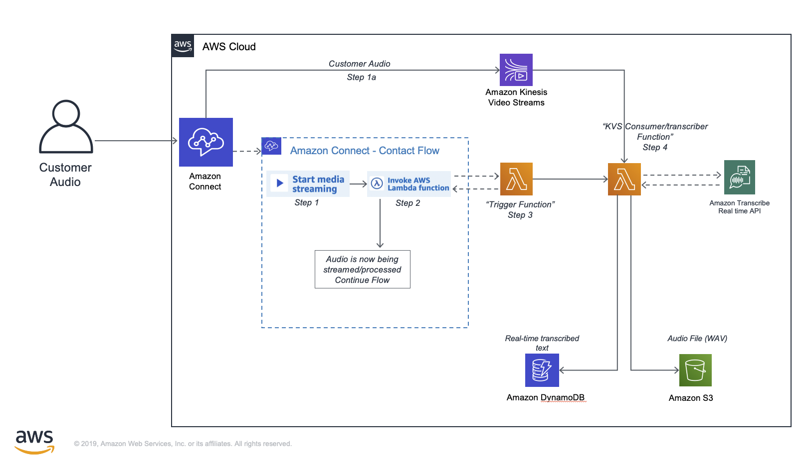

# Amazon Connect Real-time Transcription Lambda

Making it easy to get started with Amazon Connect live audio streaming and real-time transcription using Amazon Transcribe.

## On this Page
- [Project Overview](#project-overview)
- [Architecture Overview](#architecture-overview)
- [Deployment](#deployment)
- [Lambda Evnvironment Variables](#lambda-environment-variables)

## Project Overview
The purpose of this project is to provide a code example and a fully functional Lambda function to get you started with capturing and transcribing Amzon Connect phone calls using Kinesis Video Streams and Amazon Transcribe. This Lambda function can be used to create varying solutions such as capturing audio in the IVR, providing real-time transcription to agents, or even creating a voicemail solution for Amazon Connect. To enable these different use-cases, there are multiple envirnment variables controlling the behavior of the Lambda Function: [“environment variables”](#lambda-environment-variables). 

## Architecture Overview

### Description
This solution can be configured to use the following services: [Amazon Connect](https://aws.amazon.com/connect/), [Amazon Kinesis Video Streams](https://aws.amazon.com/kinesis/video-streams), [Amazon Transcribe](https://aws.amazon.com/transcribe), [Amazon DynamoDB](https://aws.amazon.com/dynamodb), [AWS Lambda](https://aws.amazon.com/lambda), and [Amazon S3](https://aws.amazon.com/s3).

With [Amazon Connect](https://aws.amazon.com/connect/), customer audio can be live streamed to through Kinesis Video Streams as described in this [Amazon Connect documentation](https://docs.aws.amazon.com/connect/latest/userguide/customer-voice-streams.html)  This project serves as an example of how to consume a an Amazon Connect live audio stream, capture the audio and send it to S3, as well as perform real-time transcription using [Amazon Transcribe](https://aws.amazon.com/transcribe). 

The Lambda code expects the Kinesis Video Stream details provided by the Amazon Connect Contact Flow as well as the Amazon Connect Contact Id. The handler function of the Lambda is present in `KVSTranscribeStreamingLambda.java` and it uses the GetMedia API of Kinesis Video Stream to fetch the InputStream of the customer audio call. The InputStream is processed using the AWS Kinesis Video Streams provided Parser Library. If the `transcriptionEnabled` property is set to true on the input, a TranscribeStreamingRetryClient client is used to send audio bytes of the audio call to Transcribe. As the transcript segments are being returned, they are saved in a DynamoDB table having ContactId as the Partition key and StartTime of the segment as the Sort key. The audio bytes are also saved in a file along with this and at the end of the audio call, the WAV audio file is uploaded to S3 in the provided `RECORDINGS_BUCKET_NAME` bucket.

## Getting Started
Getting started with this project is easy. The most basic use-case of capturing audio in the Amazon Connect IVR can be accomplished by downloading the pre-packaged Lambda Function, deploying it in your account, giving it the correct permissions to access S3 and KVS, and then invoking it and passing the details in the invocation event.

### Easy Setup
The simplest way to get started is to:
Step 1) [Download](dist/amzon-connect-realtime-transcription.zip) the pre-packaged Lambda function
### Building the project
The lambda code is designed to be built with Gradle. All requisite dependencies are captured in the `build.gradle` file. The code also depends on the [AWS Kinesis Video Streams Parser Library](https://github.com/aws/amazon-kinesis-video-streams-parser-library) which has been built into a jar can be found in the jars folder. Simply use `gradle build` to build the zip that can be deployed as an AWS Lambda application.

## Lambda Environment Variables
This Lambda Function has environment variables that conrtol its behavior:
* `REGION` - The region for AWS DynamoDB, S3 and Kinesis Video Streams resources
* `TRANSCRIBE_REGION` - The region to be used for AWS Transcribe Streaming 
* `RECORDINGS_BUCKET_NAME` - The AWS S3 bucket name where the audio files will be saved (Lambda needs to have persmissions to this bucket)
* `RECORDINGS_KEY_PREFIX` - The prefix to be used for the audio file names in AWS S3
* `RECORDINGS_PUBLIC_READ_ACL` - Set to TRUE to add public read ACL on audio file stored in S3. This will allow for anyone with S3 URL to download the audio file.
* `INPUT_KEY_PREFIX` - The prefix for the AWS S3 file name provided in the Lambda request. This file is expected to be present in `RECORDINGS_BUCKET_NAME`
* `CONSOLE_LOG_TRANSCRIPT_FLAG` - Needs to be set to TRUE if the Connect call transcriptions are to be logged.
* `TABLE_CALLER_TRANSCRIPT` - The DynamoDB table name where the transcripts need to be saved (Table Partition key must be: ContactId, and Sort Key)
* `SAVE_PARTIAL_TRANSCRIPTS` - Set to TRUE if partial segments need to saved in the DynamoDB table. Else, only complete segments will be persisted.

## License Summary
This sample code is made available under a modified MIT license. See the LICENSE file.

